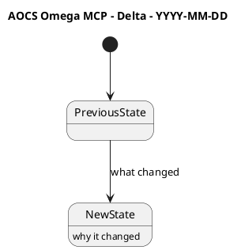
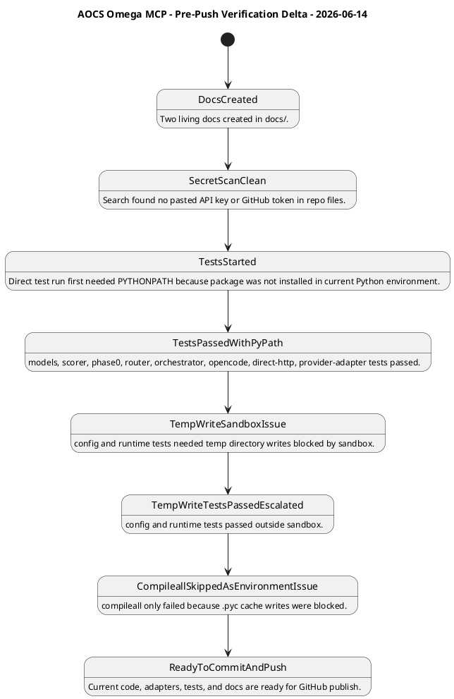
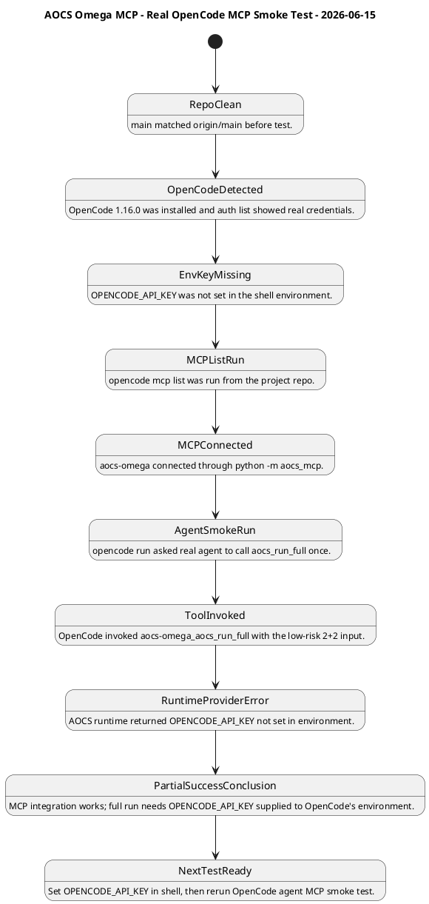
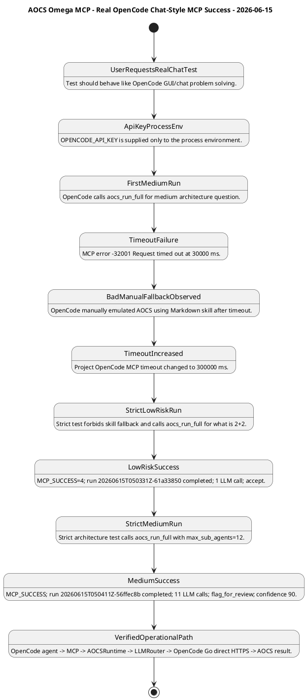

# AOCS Omega MCP - UML Statechart

This file is the visual twin of `docs/000_AOCS_OMEGA_TASK_AND_DECISION_LOG.md`.

Use this when you want to see the whole project as states instead of paragraphs.

Beginner explanation:

- A state is a condition the project can be in.
- A transition is movement from one state to another.
- A composite state is a big state that contains smaller states.
- An orthogonal region means several areas are true at the same time. For example, the architecture, provider strategy, testing strategy, and documentation strategy all exist in parallel.

Rule for future updates: do not delete old diagram sections without recording why. Add new states or add a new dated diagram section.

## 2026-06-14 - Current Project Statechart

```plantuml
@startuml AOCS_Omega_MCP_Current_State

title AOCS Omega MCP - Current System And Decision State - 2026-06-14
hide empty description

skinparam shadowing false
skinparam state {
  BackgroundColor White
  BorderColor #333333
  FontColor #111111
}

[*] --> ProjectAlive

state "ProjectAlive: AOCS Omega MCP version before GitHub push" as ProjectAlive {

  state "UserGoalAndConstraints" as UserGoalAndConstraints {
    [*] --> NeedDeterministicEngine
    NeedDeterministicEngine : AOCS must be code-enforced, not only a skill prompt.
    NeedDeterministicEngine --> NeedPortableAdapters
    NeedPortableAdapters : Must work across OpenCode, Claude Code, Cursor, Codex, and future agents.
    NeedPortableAdapters --> NeedSimpleTrigger
    NeedSimpleTrigger : User should trigger with slash command, button, MCP tool, or CLI.
    NeedSimpleTrigger --> NeedNoHostDamage
    NeedNoHostDamage : Do not silently rewrite global host-agent settings.
    NeedNoHostDamage --> NeedSecretSafety
    NeedSecretSafety : API keys and tokens stay out of repo files.
    NeedSecretSafety --> NeedLivingDocs
    NeedLivingDocs : Preserve context in text and statechart after every chat.
  }

  --

  state "ArchitectureRegion" as ArchitectureRegion {
    [*] --> SkillOnlyRejected
    SkillOnlyRejected : Markdown skill alone is not deterministic enough.
    SkillOnlyRejected --> CoreRuntimeChosen

    state "CoreRuntimeChosen" as CoreRuntimeChosen {
      [*] --> RuntimeOwnsWorkflow
      RuntimeOwnsWorkflow : AOCSRuntime owns phase order, model calls, artifacts, and final result.
      RuntimeOwnsWorkflow --> AdaptersAreButtons
      AdaptersAreButtons : MCP, CLI, and slash commands trigger runtime only.
      AdaptersAreButtons --> OuterAgentReceivesResult
      OuterAgentReceivesResult : Host coding agent receives final AOCS output.
    }

    CoreRuntimeChosen --> OnePublicMCPToolChosen

    state "OnePublicMCPToolChosen" as OnePublicMCPToolChosen {
      [*] --> PublicAocsRunFull
      PublicAocsRunFull : aocs_run_full is the canonical MCP entrypoint.
      PublicAocsRunFull --> PublicAocsAnalyzeAlias
      PublicAocsAnalyzeAlias : aocs_analyze remains as compatibility alias.
      PublicAocsAnalyzeAlias --> DebugToolsHidden
      DebugToolsHidden : Internal phase tools hidden unless expose_debug_tools is true.
    }

    OnePublicMCPToolChosen --> CLIFallbackChosen

    state "CLIFallbackChosen" as CLIFallbackChosen {
      [*] --> AocsRunCommand
      AocsRunCommand : aocs run "problem" runs AOCS without a host app.
      AocsRunCommand --> UniversalBackup
      UniversalBackup : Any agent that can run terminal commands can call AOCS.
    }
  }

  --

  state "RuntimeExecutionRegion" as RuntimeExecutionRegion {
    [*] --> RequestCreated
    RequestCreated : AOCSRunRequest carries problem, domain, risk, context, depth, budget, and metadata.
    RequestCreated --> RunIdCreated
    RunIdCreated : Runtime creates timestamp plus hash run id.
    RunIdCreated --> ArtifactsPrepared
    ArtifactsPrepared : .aocs/runs/<run-id>/ stores request, status, trace, result, summary.
    ArtifactsPrepared --> RouterPrepared
    RouterPrepared : LLMRouter resets trace and call budget.
    RouterPrepared --> OrchestratorRuns

    state "OrchestratorRuns" as OrchestratorRuns {
      [*] --> DirectLowRiskCheck
      DirectLowRiskCheck --> DirectLowRiskAnswer : low risk plus simple arithmetic
      DirectLowRiskCheck --> Phase0 : otherwise
      DirectLowRiskAnswer : one direct-answer model call, accept result.
      DirectLowRiskAnswer --> FinalResult

      Phase0 : Parse, multi-frame, map assumptions, quantify uncertainty, find root, deep test.
      Phase0 --> Phase1
      Phase1 : Score sub-problems.
      Phase1 --> Classification
      Classification : Choose Type 1, Type 2, or Type 3.
      Classification --> Type1Route : known problem
      Classification --> Type2Route : partially known / high-stakes problem
      Classification --> Type3Route : unknown / discovery problem
      Type1Route --> QualitySubject
      Type2Route --> QualitySubject
      Type3Route --> QualitySubject
      QualitySubject --> QualityGates
      QualityGates --> Observer
      Observer --> ShadowOrchestrator
      ShadowOrchestrator --> MemoryAudit
      MemoryAudit --> FinalResult
    }

    OrchestratorRuns --> ArtifactsWritten
    ArtifactsWritten : trace.json, result.json, summary.md, and final status.json are written.
    ArtifactsWritten --> RuntimeReturns
    RuntimeReturns : MCP or CLI receives structured AnalysisResult.
  }

  --

  state "ProviderStrategyRegion" as ProviderStrategyRegion {
    [*] --> DirectApiBaseline
    DirectApiBaseline : Reliable baseline uses explicit provider APIs.

    state "DirectApiBaseline" as DirectApiBaseline {
      [*] --> OpenCodeGoDirect
      OpenCodeGoDirect : Preferred current test path. Uses OPENCODE_API_KEY and hosted HTTPS.
      OpenCodeGoDirect --> OpenAIFamily
      OpenAIFamily : OpenAI provider supported.
      OpenAIFamily --> AnthropicFamily
      AnthropicFamily : Anthropic provider and claude alias supported.
      AnthropicFamily --> OpenRouterFamily
      OpenRouterFamily : OpenRouter provider supported with OPENROUTER_API_KEY.
      OpenRouterFamily --> GeminiFamily
      GeminiFamily : Gemini and google alias supported with GEMINI_API_KEY or GOOGLE_API_KEY.
      GeminiFamily --> NvidiaFamily
      NvidiaFamily : NVIDIA and nvidia-nim alias supported with NVIDIA_API_KEY.
    }

    DirectApiBaseline --> HostCliKeptAsFallback
    HostCliKeptAsFallback : Host CLI can exist, but it is fragile and not primary.
    HostCliKeptAsFallback --> MCPSamplingDeferred
    MCPSamplingDeferred : MCP Sampling researched, promising, but deferred for this version.
  }

  --

  state "AdapterRegion" as AdapterRegion {
    [*] --> OpenCodeAdapter

    state "OpenCodeAdapter" as OpenCodeAdapter {
      [*] --> OpenCodeProjectConfig
      OpenCodeProjectConfig : opencode.jsonc starts python -m aocs_mcp as local MCP server.
      OpenCodeProjectConfig --> OpenCodeSlashCommand
      OpenCodeSlashCommand : .opencode/commands/aocs-run.md is a thin trigger.
    }

    OpenCodeAdapter --> ClaudeAdapter

    state "ClaudeAdapter" as ClaudeAdapter {
      [*] --> ClaudeSlashCommand
      ClaudeSlashCommand : .claude/commands/aocs-run.md is a thin trigger.
      ClaudeSlashCommand --> ClaudeMCPExample
      ClaudeMCPExample : README documents python -m aocs_mcp MCP config pattern.
    }

    ClaudeAdapter --> FutureAdapters
    FutureAdapters : Cursor, Codex, and future agents should use MCP or CLI without core rewrites.
  }

  --

  state "SafetyAndConfigRegion" as SafetyAndConfigRegion {
    [*] --> ProjectScopedFirst
    ProjectScopedFirst : Prefer project configs over global host-agent edits.
    ProjectScopedFirst --> SecretsInEnv
    SecretsInEnv : Keys use environment variables, never committed files.
    SecretsInEnv --> RunStorageIsolated
    RunStorageIsolated : AOCS stores artifacts in .aocs/runs, not host agent databases.
    RunStorageIsolated --> SmallMcpSurface
    SmallMcpSurface : Only main tools visible by default to reduce context load and misuse.
  }

  --

  state "TestingAndEvidenceRegion" as TestingAndEvidenceRegion {
    [*] --> ProviderSmokeTestPassed
    ProviderSmokeTestPassed : OpenCode Go direct HTTPS returned TEST_OK.
    ProviderSmokeTestPassed --> RuntimeSimpleTestPassed
    RuntimeSimpleTestPassed : what is 2+2 returned 4 through direct-low-risk route.
    RuntimeSimpleTestPassed --> MCPProtocolTestPassed
    MCPProtocolTestPassed : MCP listed aocs_run_full and aocs_analyze and tool call worked.
    MCPProtocolTestPassed --> OpenCodeMCPIsolatedConnected
    OpenCodeMCPIsolatedConnected : Isolated OpenCode config showed aocs-omega connected.
    OpenCodeMCPIsolatedConnected --> ScriptTestsPassed
    ScriptTestsPassed : Runtime, router, provider, direct HTTP, orchestrator, config, phase0, scorer tests passed.
    ScriptTestsPassed --> SecretScanClean
    SecretScanClean : No obvious committed API key or server password found.
  }

  --

  state "DocumentationAndPublishingRegion" as DocumentationAndPublishingRegion {
    [*] --> LivingDocsCreated
    LivingDocsCreated : Create text decision log and UML statechart docs.
    LivingDocsCreated --> AppendOnlyPolicy
    AppendOnlyPolicy : Future chats append instead of deleting historical context.
    AppendOnlyPolicy --> ReadyForGitCommit
    ReadyForGitCommit : Commit current runtime, adapters, providers, tests, and docs.
    ReadyForGitCommit --> ReadyForGitHubPush
    ReadyForGitHubPush : Push version to budhasantosh010/AOCS-OmegaMCP.
  }
}

ProjectAlive --> VersionPublished : after successful git commit and push
VersionPublished : Remote repository contains this documented AOCS runtime version.

@enduml
```

## Future Update Template

Add a new dated section with either a full replacement statechart or a small delta diagram.

## 2026-06-14 - Pre-Push Verification Delta

## 2026-06-15 - Real OpenCode MCP Smoke Test Delta

## 2026-06-15 - Real OpenCode Chat-Style MCP Success Delta

